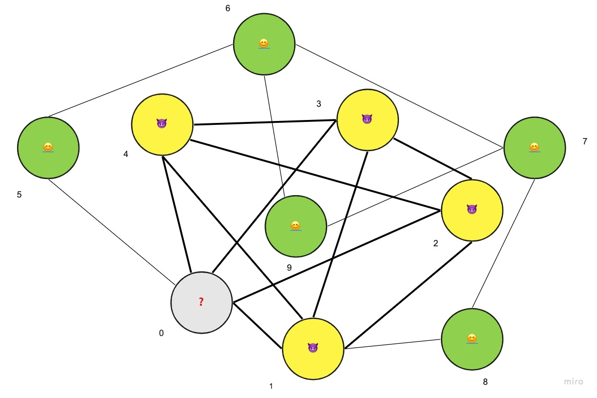

# quantum-scam-finder

## Description
Finds clique nodes in a graph using quantum computing optimisers.

## Problem statement

1. This is a bank customer graph. Each node represents a customer.
2. Here the edges between each customer can be a interaction (chat, email,add benificary, calls, transfer of money)
3. Here node 1,2,3,4 has been identified as scammer nodes by before. But node 0 is not identified as neither scammer or good node.
**The clique technique helps to classify this node 0 as either scammer or good node. It also helps to identify scam rings thereby to identify common attributes amongst each of these scammer customers. We can create precautionary steps on this identified attributes so that the bank can weed out scammers early on**
